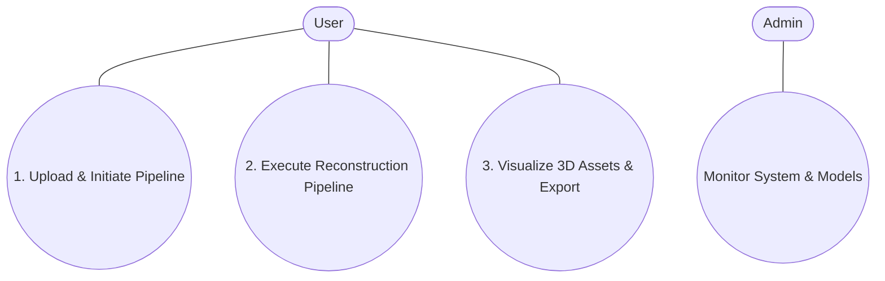

# KLE Society's

# KLE Technological University, Hubballi

## Department Of MCA

### MCA IV Semester

# CHAPTER – 3

# SOFTWARE REQUIREMENT SPECIFICATION

## On

# “Automated Single-Image to 3D Asset and Point Cloud Generation System”

**Submitted by:**
Rajashekhar B Durgad (01FE24MCA027)

**Under the Guidance of:**
Prof. Akash Hulkund

**KLE Technological University**
Vidyanagar, Hubballi – 580031
2025-2026

---

## 3.1 Overview of SRS

This Software Requirements Specification (SRS) document describes the complete functional and non-functional requirements for the Automated Single-Image to 3D Asset and Point Cloud Generation System. The system is a fully automated, end-to-end generative AI and point cloud analysis pipeline that reconstructs high-fidelity textured 3D assets and segmented 3D point clouds from a single RGB image input.

The SRS is structured to define the system's behaviour, interfaces, performance criteria, and design constraints. It serves as a baseline for system design, implementation, and acceptance testing.

## 3.2 Requirement Specifications

This section outlines the functional capabilities and operational constraints of the system.

### 3.2.1 Functional Requirements

Functional requirements define the core capabilities and end-to-end processing steps executed by the system.

| FR ID | Requirement                                                                      | Priority |
| :---- | :------------------------------------------------------------------------------- | :------- |
| FR-01 | The system shall allow users to upload a single RGB image.                       | High     |
| FR-02 | The system shall validate uploaded images before processing.                     | High     |
| FR-03 | The system shall analyse and enhance image quality when required.                | High     |
| FR-04 | The system shall automatically generate an image caption and detection prompt.   | High     |
| FR-05 | The system shall detect the primary object in the uploaded image.                | High     |
| FR-06 | The system shall segment the detected object and remove its background.          | High     |
| FR-07 | The system shall generate a textured 3D mesh from the processed image.           | High     |
| FR-08 | The system shall generate and segment a point cloud from the reconstructed mesh. | High     |
| FR-09 | The system shall allow users to view and download generated outputs.             | High     |
| FR-10 | The system shall provide secure user authentication and session management.      | High     |
| FR-11 | The system shall maintain a history of user reconstruction jobs.                 | Medium   |

### 3.2.2 Use Case Diagrams



**Primary Actors:**

- **User:** Authenticated individual who uploads RGB images, monitors pipeline execution, views 3D meshes/point clouds, and downloads output artifacts.
- **Admin:** System administrator responsible for monitoring GPU compute node health and managing AI model weights.

**System Boundary:** The Automated Single-Image to 3D Asset and Point Cloud Generation System.

### 3.2.3 Use Case Descriptions

The tables below provide structured descriptions for the three most significant use cases of the Automated Single-Image to 3D Asset and Point Cloud Generation System. Each description follows the Pressman use case template, capturing the primary actor, trigger, main flow, alternative flows, and postconditions to provide a complete behavioural specification.

**Use Case 1: Image Upload and Reconstruction Job Initiation**

| Field                                       | Description                                                                                                                                                                                                                                                                                                                                                                                                                             |
| :------------------------------------------ | :-------------------------------------------------------------------------------------------------------------------------------------------------------------------------------------------------------------------------------------------------------------------------------------------------------------------------------------------------------------------------------------------------------------------------------------- |
| **Use Case Name**                     | Image Upload and Reconstruction Job Initiation                                                                                                                                                                                                                                                                                                                                                                                          |
| **Primary Actor**                     | Authenticated User                                                                                                                                                                                                                                                                                                                                                                                                                      |
| **Trigger**                           | User submits an RGB image file via the web application interface.                                                                                                                                                                                                                                                                                                                                                                       |
| **Preconditions**                     | User is logged in with a valid JWT token; application backend and Supabase services are online.                                                                                                                                                                                                                                                                                                                                         |
| **Postconditions**                    | Image file is validated and stored; a job entry (ID) is recorded in the database; background pipeline task is spawned.                                                                                                                                                                                                                                                                                                                  |
| **Main Success Scenario (Main Flow)** | 1. User navigates to the image upload section.2. User selects or drops an RGB image file.3. System validates file extension (JPG/PNG/WEBP/BMP), size (≤ 25 MB), and image magic header bytes.4. System writes original image to storage and creates a job record with status "queued".5. System triggers asynchronous backend reconstruction task.6. System redirects user to the processing tracker interface with the unique Job ID. |
| **Alternative Flows**                 | 3a. Unsupported image extension or corrupt image header.&nbsp;&nbsp;&nbsp;&nbsp;3a1. System notifies user: "Invalid file format or corrupted image header."&nbsp;&nbsp;&nbsp;&nbsp;3a2. Job creation is aborted and user remains on upload page.3b. File size exceeds maximum limit of 25 MB.&nbsp;&nbsp;&nbsp;&nbsp;3b1. System prompts user to compress or select an image under 25 MB limit.                                         |

**Use Case 2: Multi-Stage 3D Asset & Point Cloud Pipeline Execution**

| Field                                       | Description                                                                                                                                                                                                                                                                                                                                                                                                                                                       |
| :------------------------------------------ | :---------------------------------------------------------------------------------------------------------------------------------------------------------------------------------------------------------------------------------------------------------------------------------------------------------------------------------------------------------------------------------------------------------------------------------------------------------------- |
| **Use Case Name**                     | Multi-Stage 3D Asset & Point Cloud Pipeline Execution                                                                                                                                                                                                                                                                                                                                                                                                             |
| **Primary Actor**                     | Automated Pipeline Execution Worker (System / Background Worker)                                                                                                                                                                                                                                                                                                                                                                                                  |
| **Trigger**                           | System enqueues a valid Job ID following successful image upload.                                                                                                                                                                                                                                                                                                                                                                                                 |
| **Preconditions**                     | GPU worker node (NVIDIA CUDA runtime) is available with requisite model weights pre-cached.                                                                                                                                                                                                                                                                                                                                                                       |
| **Postconditions**                    | Image captioning, object segmentation, textured 3D mesh (GLB), and segmented point cloud (PLY) are successfully generated and saved.                                                                                                                                                                                                                                                                                                                              |
| **Main Success Scenario (Main Flow)** | 1. Worker fetches queued Job ID and sets status to "processing".2. Stage 1: BLIP model generates image caption and detection prompt.3. Stage 2: RemBG / Segment Anything model extracts primary object and removes background.4. Stage 3: Tripo3D / CRM model generates textured 3D mesh (GLB).5. Stage 4: Open3D generates 3D point cloud, extracts geometric normals, and exports PLY file.6. Worker updates job status to "completed" and saves artifact URLs. |
| **Alternative Flows**                 | 2a–5a. Exception or out-of-memory failure during model execution.&nbsp;&nbsp;&nbsp;&nbsp;2a1. Worker captures failure trace and releases allocated GPU VRAM memory.&nbsp;&nbsp;&nbsp;&nbsp;2a2. Worker updates job status to "failed" with descriptive stage error message.&nbsp;&nbsp;&nbsp;&nbsp;2a3. User interface displays actionable failure feedback.                                                                                                     |

**Use Case 3: Interactive 3D Model Visualization and Asset Export**

| Field                                       | Description                                                                                                                                                                                                                                                                                                                                                                                                                                                                             |
| :------------------------------------------ | :-------------------------------------------------------------------------------------------------------------------------------------------------------------------------------------------------------------------------------------------------------------------------------------------------------------------------------------------------------------------------------------------------------------------------------------------------------------------------------------- |
| **Use Case Name**                     | Interactive 3D Model Visualization and Asset Export                                                                                                                                                                                                                                                                                                                                                                                                                                     |
| **Primary Actor**                     | Authenticated User                                                                                                                                                                                                                                                                                                                                                                                                                                                                      |
| **Trigger**                           | Reconstruction job reaches "completed" status or user opens a past job from history.                                                                                                                                                                                                                                                                                                                                                                                                    |
| **Preconditions**                     | Reconstruction job completed successfully and generated output artifacts (GLB, PLY, PNG, JSON) are available.                                                                                                                                                                                                                                                                                                                                                                           |
| **Postconditions**                    | User interactively inspects 3D model geometry and downloads selected asset files to local storage.                                                                                                                                                                                                                                                                                                                                                                                      |
| **Main Success Scenario (Main Flow)** | 1. User navigates to the results page for a completed reconstruction job.2. Web client fetches GLB asset and renders 3D mesh inside React Three Fiber viewer with orbit controls.3. User rotates, pans, zooms, and toggles between textured 3D mesh and point cloud visualization modes.4. User selects "Download" for desired artifact formats (GLB, PLY, PNG, metadata JSON).5. System verifies user access rights via Supabase Row-Level Security (RLS) and streams requested files. |
| **Alternative Flows**                 | 4a. User attempts to download artifact from an unauthenticated session.&nbsp;&nbsp;&nbsp;&nbsp;4a1. System blocks request and redirects user to login interface.4b. User browses historic jobs.&nbsp;&nbsp;&nbsp;&nbsp;4b1. System renders paginated job list allowing filtering by status or date.                                                                                                                                                                                     |

### 3.2.4 Nonfunctional Requirements

Beyond functional correctness, a production-quality system must also satisfy quality attributes such as performance, security, and reliability. The non-functional requirements below define the operational constraints the Automated Single-Image to 3D Asset and Point Cloud Generation System must satisfy, grouped into three categories.

#### 3.2.4.1 Performance & Resource Efficiency

- **Pipeline Execution Latency:** The end-to-end reconstruction pipeline shall complete within 3 to 4 minutes on a dedicated NVIDIA T4 (16 GB VRAM) GPU worker node.
- **API Response Latency:** Non-blocking API endpoints (health checks, job status polling, metadata requests) shall respond within 15 milliseconds.
- **Strict VRAM Capping:** The compute node VRAM footprint shall not exceed 16 GB peak usage at any stage through sequential model execution and explicit GPU cache flushing (`torch.cuda.empty_cache()`).

#### 3.2.4.2 Security & Data Isolation

- **Authentication & Token Management:** All non-public endpoints shall require a valid JWT token passed via standard Authorization headers.
- **Row-Level Security (RLS):** Supabase database RLS policies shall enforce data isolation, ensuring users can only read or download their own job records and generated 3D artifacts.
- **Sanitized File Ingestion:** Uploaded files shall undergo strict validation covering extension, file size (≤ 25 MB), and binary magic-byte inspection to prevent execution of malicious payloads.

#### 3.2.4.3 Reliability & Fault Tolerance

- **Graceful Error Handling:** Stage-level pipeline failures shall be trapped safely, updating job status to "failed" and recording diagnostic error logs without crashing the application daemon.
- **State Integrity Guarantee:** Incomplete or failed pipeline executions shall not produce or mark corrupted artifact files as valid.
- **Resilient Fallback Mechanism:** In the event of primary database connectivity failure, the backend shall log job metadata locally to prevent pipeline task loss.

## 3.3 Software & Hardware Requirements

Successful development and operation of the Automated Single-Image to 3D Asset and Point Cloud Generation System depend on a specific set of software and hardware prerequisites. The following tables define the technical environment within which the system was built and tested.

### 3.3.1 Software Requirements

The software components and libraries used in the development of the system are listed below, along with their roles in the system.

| Component                         | Specification                                               |
| :-------------------------------- | :---------------------------------------------------------- |
| **Operating System**        | Linux (Ubuntu 22.04 LTS) / Windows 11                       |
| **Programming Languages**   | Python 3.10+, JavaScript / TypeScript                       |
| **Deep Learning Framework** | PyTorch 2.x with CUDA 12.1                                  |
| **AI Models & Libraries**   | HuggingFace Transformers, rembg, Tripo3D / CRM              |
| **3D & Image Processing**   | Open3D ≥ 0.16, OpenCV, Pillow, NumPy                       |
| **Frontend Framework**      | Next.js 15, React 19, React Three Fiber, Drei, Tailwind CSS |
| **Backend Framework**       | FastAPI, Uvicorn, Pydantic                                  |
| **Database & Auth**         | Supabase (PostgreSQL), Supabase Auth (JWT)                  |

### 3.3.2 Hardware Requirements

The physical hardware components required for the development, testing, and operation of the system are specified below.

| Component                     | Specification                                                      |
| :---------------------------- | :----------------------------------------------------------------- |
| **GPU Compute Node**    | NVIDIA T4 / A10G (minimum 16 GB VRAM)                              |
| **CUDA Acceleration**   | CUDA 12.1 runtime                                                  |
| **System Memory (RAM)** | Minimum 12 GB system RAM (16 GB recommended)                       |
| **Storage**             | Minimum 50 GB NVMe SSD (Model weights & outputs)                   |
| **Network Interface**   | High-speed internet for initial HuggingFace model weights download |

## 3.4 GUI of the Proposed System

The navigation tree below illustrates the screen hierarchy of the Automated Single-Image to 3D Asset and Point Cloud Generation System within the application, showing the flow from authentication through the main Upload interface, real-time stage progress tracker, interactive 3D viewer, job history, and profile views.

```
Login / Signup Page
│
├── Authentication
│   ├── Email
│   ├── Password
│   └── User Authentication
│
└── Dashboard
    │
    ├── Upload Page
    │   ├── Image Upload
    │   └── Start Reconstruction
    │
    ├── Processing Page
    │   ├── Pipeline Progress
    │   ├── Processing Status
    │   └── Progress Bar
    │
    ├── Results Page
    │   ├── 3D Model Viewer
    │   ├── Point Cloud Viewer
    │   ├── Download Artifacts
    │   └── Job Summary
    │
    ├── History Page
    │   ├── Job History
    │   ├── Search & Filter
    │   └── Job Details
    │
    └── Profile Page
        ├── User Information
        └── Usage Statistics
```

## 3.5 Acceptance Test Plan

The acceptance test scenarios below were used to validate that the Automated Single-Image to 3D Asset and Point Cloud Generation System meets the functional requirements specified in Section 3.2. Each entry describes a user action, the expected system response, and whether it was satisfied during final testing. Full test case details are documented in Chapter 6.

| Test ID | Test Scenario                                   | Expected Result                                                 |
| :------ | :---------------------------------------------- | :-------------------------------------------------------------- |
| AT-01   | User registers or logs in                       | Authenticated with valid JWT session token                      |
| AT-02   | User uploads a valid RGB image (≤ 25 MB)       | Image validated; job created with "queued" status               |
| AT-03   | User uploads unsupported format or file > 25 MB | Error message displayed; job creation aborted                   |
| AT-04   | System executes background pipeline             | Progress updates live from 0% to 100% across stages             |
| AT-05   | System generates textured 3D mesh               | Interactive GLB 3D mesh renders in viewer with orbit controls   |
| AT-06   | User toggles point cloud view                   | 3D point cloud (PLY) visualization rendered                     |
| AT-07   | User downloads generated artifact files         | Selected GLB, PLY, PNG, or JSON files streamed to local machine |
| AT-08   | User views job history                          | Paginated job list rendered with search and filter controls     |
