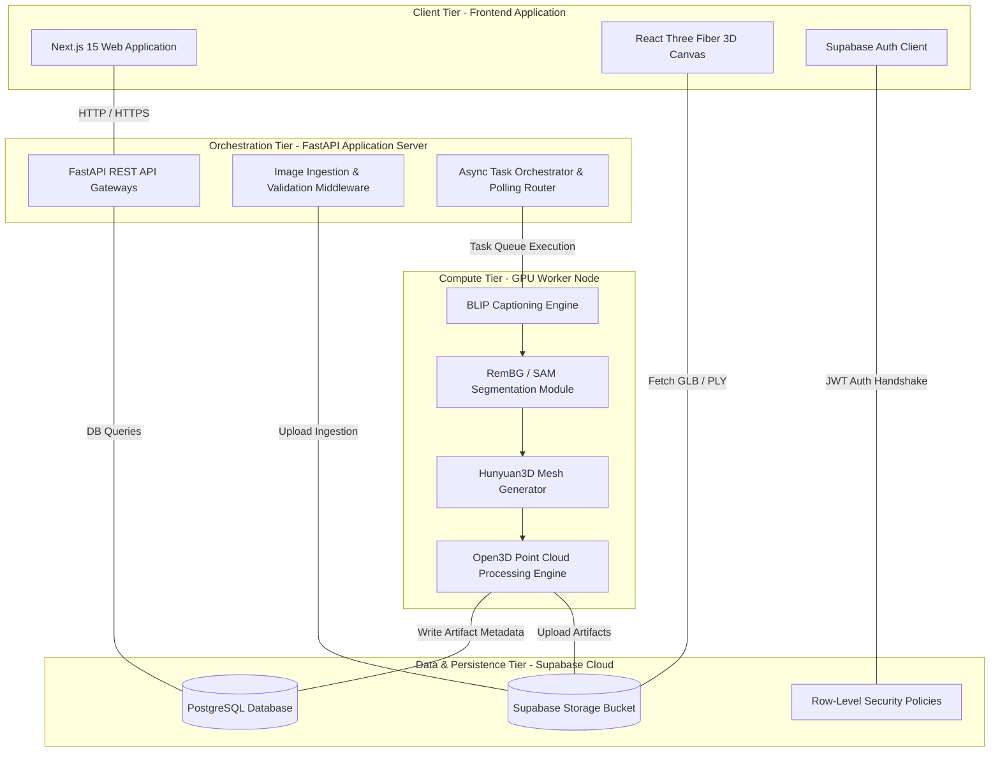
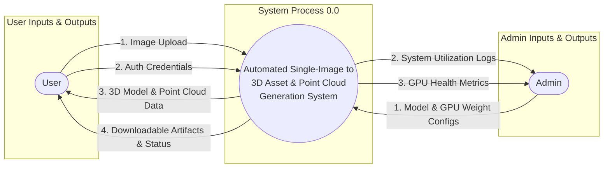
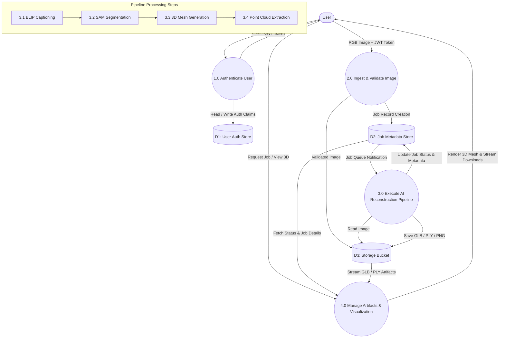
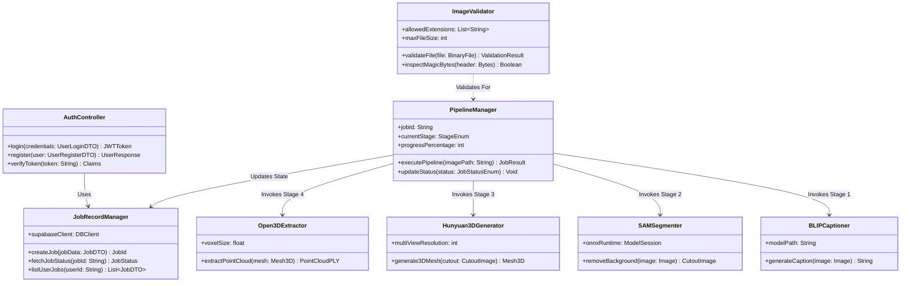
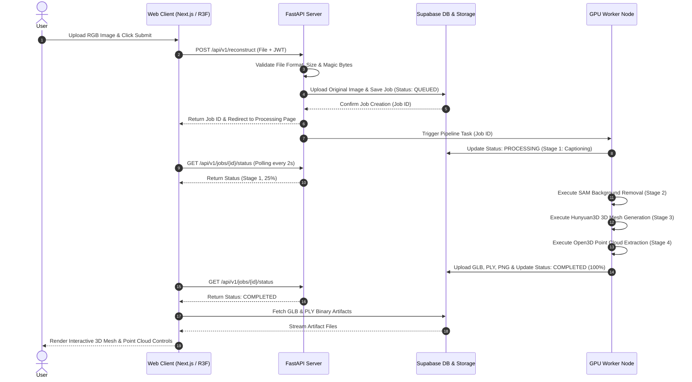
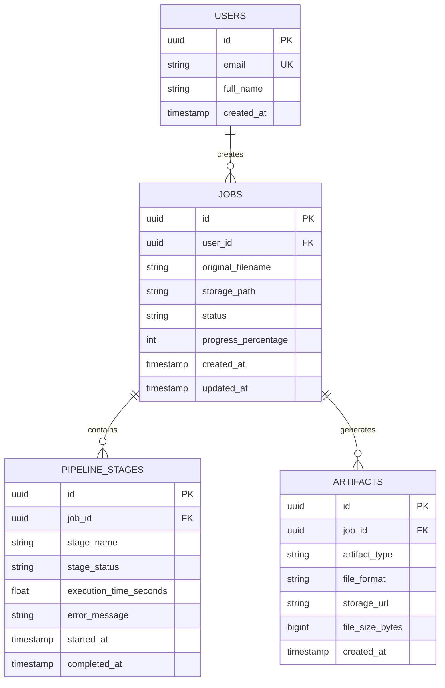

# KLE Society's

# KLE Technological University, Hubballi

## Department Of MCA

### MCA IV Semester

# CHAPTER – 4

# SYSTEM DESIGN

## On

# “Automated Single-Image to 3D Asset and Point Cloud Generation System”

**Submitted by:**
Rajashekhar B Durgad (01FE24MCA027)

**Under the Guidance of:**
Prof. Akash Hulkund

**KLE Technological University**
Vidyanagar, Hubballi – 580031
2025-2026

---

## 4.1 Architecture of the System

The Automated Single-Image to 3D Asset and Point Cloud Generation System follows a decoupled, 4-tier micro-service architecture designed for high throughput, scalable compute resource isolation, and responsive user interaction. The system separates user-facing interaction components from compute-intensive AI execution modules and cloud persistence services.

```
                        System Architecture

+------------------------------------------------------+
|                 Client Tier (Frontend)               |
|------------------------------------------------------|
| • Web Application (Next.js 15 / React 19)            |
| • 3D Model & Point Cloud Viewer (React Three Fiber)  |
| • User Authentication & Session State                |
+---------------------------+--------------------------+
                            |
                     HTTP / HTTPS (JWT)
                            |
+---------------------------v--------------------------+
|           Application Tier (Backend Server)          |
|------------------------------------------------------|
| • REST API Gateway (FastAPI)                         |
| • Image Validation & File Ingestion                  |
| • Task Queue & Pipeline Management                   |
| • Status Polling Controller                          |
+---------------------------+--------------------------+
                            |
                            |
+---------------------------v--------------------------+
|              AI Processing Tier (GPU Worker)         |
|------------------------------------------------------|
| • Image Captioning (BLIP)                            |
| • Object Detection & Segmentation (SAM / RemBG)      |
| • 3D Reconstruction (Hunyuan3D)            |
| • Point Cloud Generation (Open3D)                    |
+---------------------------+--------------------------+
                            |
                            |
+---------------------------v--------------------------+
|              Data & Storage Tier (Supabase)          |
|------------------------------------------------------|
| • Relational Database (PostgreSQL)                   |
| • Binary File Storage (GLB, PLY, PNG, JSON)          |
| • User Data & Row-Level Security (RLS)               |
+------------------------------------------------------+
```



### Architectural Explanation

* **Client Tier:** Handles user interaction and renders interactive 3D meshes and point clouds using Next.js and React Three Fiber.
* **Application Tier:** Serves as the REST API gateway (FastAPI) for request validation, user authentication, and task queue orchestration.
* **AI Processing Tier:** Executes the 4-stage GPU AI pipeline (BLIP, SAM, Hunyuan3D, Open3D) with automatic VRAM memory management.
* **Data & Storage Tier:** Persists relational job metadata, user accounts, and 3D output artifacts (GLB, PLY, PNG) via Supabase Cloud.

---

## 4.2 Level 0 DFD (Context Diagram)

The Level 0 Data Flow Diagram (DFD) defines the highest-level conceptual view of the system boundary, illustrating data exchanges between external entities (**User** and **System Admin**) and the central system process.



### Explanation of Level 0 DFD

- **User Entity:** Sends raw RGB images, authentication credentials, and request configurations to the system. Receives real-time stage progress, rendered interactive 3D meshes, point cloud visualizations, and downloadable output files.
- **System Admin Entity:** Monitors compute node health, updates pipeline model configurations, and reviews diagnostic system logs.
- **Process 0.0:** Represents the entire Automated Single-Image to 3D Asset and Point Cloud Generation System operating as a single unified process boundary.

---

## 4.3 Detailed DFD for the Proposed System (Level 1 DFD)

The expanded DFD below decomposes the internal processing of the system, tracing how a single RGB image submitted by the User flows through the Image Validation Controller, is processed via the multi-stage AI reconstruction pipeline (BLIP, SAM, Hunyuan3D, Open3D) in sequence, and ultimately results in an interactive WebGL 3D model viewer and downloadable output artifacts.



### Explanation of Detailed DFD (Level 1)

1. **Process 1.0 (Authenticate User):** Verifies user credentials against `D1: User Auth Store` (Supabase Auth) and returns a signed JWT token for session authorization.
2. **Process 2.0 (Ingest & Validate Image):** Validates uploaded image format, size (≤ 25 MB), and magic header bytes. Stores the raw image in `D3: Storage Bucket` and creates a new job record with state `QUEUED` in `D2: Job Metadata Store`.
3. **Process 3.0 (Execute AI Reconstruction Pipeline):** Asynchronously executes the 4-stage pipeline (BLIP captioning $\rightarrow$ SAM segmentation $\rightarrow$ Hunyuan3D mesh generation $\rightarrow$ Open3D point cloud extraction). Updates stage progress in `D2` and saves generated files in `D3`.
4. **Process 4.0 (Manage Artifacts & Visualization):** Retrieves completed job records from `D2`, streams GLB mesh and PLY point cloud binary streams from `D3`, and renders interactive 3D views in the client browser.

---

## 4.4 Class Diagram

The class diagram below identifies the primary classes of the Automated Single-Image to 3D Asset and Point Cloud Generation System — `AuthController`, `ImageValidator`, `PipelineManager`, `BLIPCaptioner`, `SAMSegmenter`, `Hunyuan3DGenerator`, `Open3DExtractor`, and `JobRecordManager` — along with their attributes, methods, and inter-class relationships, reflecting the object-oriented design of the system.



### Brief Explanation

- **`AuthController`:** Manages user authentication, sign-up, and JWT token validation.
- **`ImageValidator`:** Enforces ingestion rules (allowed formats, size caps, magic header validation).
- **`PipelineManager`:** Orchestrates stage-by-stage pipeline execution, managing status updates and memory cleanup.
- **`BLIPCaptioner` / `SAMSegmenter` / `Hunyuan3DGenerator` / `Open3DExtractor`:** Specialized AI stage classes executing modular inference tasks.
- **`JobRecordManager`:** Interfaces with Supabase database to persist job records, query history, and maintain RLS isolation.

---

## 4.5 Sequence Diagram

The sequence diagram depicts the chronological interaction sequence between the User, Web Frontend, FastAPI Backend, GPU Compute Worker, and Supabase Cloud.



### Brief Explanation

1. **Step 1–6 (Submission):** User submits an RGB image. The backend validates format and size, stores the file in Supabase, enqueues the job ID, and redirects the client.
2. **Step 7–12 (Pipeline Execution & Polling):** The GPU worker executes pipeline stages sequentially. The frontend polls status every 2 seconds to update live progress bars.
3. **Step 13–17 (Rendering & Export):** Upon job completion, output GLB and PLY files are fetched from Supabase Storage and rendered in the client browser using React Three Fiber.

---

## 4.6 ER Diagram and Schema

The Entity-Relationship (ER) diagram defines the database entities, attributes, primary/foreign keys, and relational cardinality in the Supabase PostgreSQL database.



### Database Schema Specification

#### Table 1: `USERS`

| Column Name    | Data Type    | Constraints      | Description                     |
| :------------- | :----------- | :--------------- | :------------------------------ |
| `id`         | UUID         | Primary Key      | Supabase Auth unique identifier |
| `email`      | VARCHAR(255) | Unique, Not Null | User email address              |
| `full_name`  | VARCHAR(255) | Nullable         | Full name of user               |
| `created_at` | TIMESTAMPTZ  | Default NOW()    | Registration timestamp          |

#### Table 2: `JOBS`

| Column Name             | Data Type    | Constraints                | Description                                                   |
| :---------------------- | :----------- | :------------------------- | :------------------------------------------------------------ |
| `id`                  | UUID         | Primary Key                | Unique job ID                                                 |
| `user_id`             | UUID         | Foreign Key (`USERS.id`) | Job owner ID                                                  |
| `original_filename`   | VARCHAR(255) | Not Null                   | Name of uploaded file                                         |
| `storage_path`        | TEXT         | Not Null                   | Storage bucket path                                           |
| `status`              | VARCHAR(50)  | Not Null                   | State (`QUEUED`, `PROCESSING`, `COMPLETED`, `FAILED`) |
| `progress_percentage` | INT          | Default 0                  | Overall progress (0–100%)                                    |
| `created_at`          | TIMESTAMPTZ  | Default NOW()              | Submission timestamp                                          |
| `updated_at`          | TIMESTAMPTZ  | Default NOW()              | Last state update timestamp                                   |

#### Table 3: `PIPELINE_STAGES`

| Column Name                | Data Type    | Constraints               | Description                                                                |
| :------------------------- | :----------- | :------------------------ | :------------------------------------------------------------------------- |
| `id`                     | UUID         | Primary Key               | Stage execution record ID                                                  |
| `job_id`                 | UUID         | Foreign Key (`JOBS.id`) | Associated job ID                                                          |
| `stage_name`             | VARCHAR(100) | Not Null                  | Stage name (`Captioning`, `Segmentation`, `MeshGen`, `PointCloud`) |
| `stage_status`           | VARCHAR(50)  | Not Null                  | Stage status (`PENDING`, `RUNNING`, `SUCCESS`, `FAILED`)           |
| `execution_time_seconds` | FLOAT        | Nullable                  | Duration of stage                                                          |
| `error_message`          | TEXT         | Nullable                  | Stage failure diagnostic message                                           |

#### Table 4: `ARTIFACTS`

| Column Name         | Data Type   | Constraints               | Description                                                            |
| :------------------ | :---------- | :------------------------ | :--------------------------------------------------------------------- |
| `id`              | UUID        | Primary Key               | Artifact ID                                                            |
| `job_id`          | UUID        | Foreign Key (`JOBS.id`) | Associated job ID                                                      |
| `artifact_type`   | VARCHAR(50) | Not Null                  | Type (`GLB_MESH`, `PLY_POINTCLOUD`, `PNG_CUTOUT`, `JSON_META`) |
| `file_format`     | VARCHAR(10) | Not Null                  | Extension (`glb`, `ply`, `png`, `json`)                        |
| `storage_url`     | TEXT        | Not Null                  | Download URL                                                           |
| `file_size_bytes` | BIGINT      | Not Null                  | Size of file in bytes                                                  |

---

## 4.7 State Transition Diagram

The state transition diagram models the finite state machine representing the complete lifecycle of a 3D reconstruction job, transitioning from initial upload (`QUEUED`), through sequential GPU pipeline stages (`PREPROCESSING` $\rightarrow$ `SEGMENTING` $\rightarrow$ `GENERATING_MESH` $\rightarrow$ `EXTRACTING_POINT_CLOUD`), to terminal completion (`COMPLETED`) or graceful failure recovery (`FAILED`).

```mermaid
stateDiagram-v8
    [*] --> QUEUED : Image Uploaded & Job Created
    QUEUED --> PREPROCESSING : Worker Fetches Job
    PREPROCESSING --> SEGMENTING : Image Validated & Caption Generated (BLIP)
    SEGMENTING --> GENERATING_MESH : Background Removed (SAM)
    GENERATING_MESH --> EXTRACTING_POINT_CLOUD : Textured 3D Mesh Synthesized (Hunyuan3D)
    EXTRACTING_POINT_CLOUD --> COMPLETED : Point Cloud Exported & Artifacts Saved (Open3D)

    PREPROCESSING --> FAILED : Invalid Image / Corrupt Bytes
    SEGMENTING --> FAILED : Segmentation Error
    GENERATING_MESH --> FAILED : CUDA Out-Of-Memory / Generator Error
    EXTRACTING_POINT_CLOUD --> FAILED : Open3D Processing Failure

    FAILED --> [*]
    COMPLETED --> [*]
```

### Explanation of Lifecycle States

- **`QUEUED`:** Job record created; awaiting GPU worker pickup.
- **`PREPROCESSING`:** BLIP model analyzes image and generates text prompt.
- **`SEGMENTING`:** SAM extracts primary object and strips background clutter.
- **`GENERATING_MESH`:** Hunyuan3D synthesizes 3D triplane representation and extracts `.GLB` mesh.
- **`EXTRACTING_POINT_CLOUD`:** Open3D samples 3D surface vertices, computes normals, and exports `.PLY` point cloud.
- **`COMPLETED`:** All artifacts uploaded to storage bucket; status set to 100% complete.
- **`FAILED`:** Error caught at any stage; GPU VRAM flushed; error details recorded in job log.

---

## 4.8 Data Structure Used

The system utilizes specialized in-memory, spatial, and persistent data structures to optimize performance, memory efficiency, and 3D geometric operations.

### 1. Triplane Tensor Arrays ($3 \times C \times H \times W$)

- **Context:** Used inside Hunyuan3D / LRM generative models.
- **Structure:** Represents 3D space via three orthogonal 2D feature planes ($XY$, $XZ$, $YZ$).
- **Purpose:** Enables instant feed-forward querying of implicit 3D density and color features without requiring full 3D voxel grid memory overhead.

### 2. Mesh Geometric Matrices ($V \in \mathbb{R}^{N \times 3}, F \in \mathbb{Z}^{M \times 3}$)

- **Context:** Used during 3D mesh extraction and GLB serialization.
- **Structure:**
  - **Vertex Matrix ($V$):** Floating-point array storing 3D spatial coordinates $(x, y, z)$ for $N$ surface vertices.
  - **Face Matrix ($F$):** Integer triangle index array connecting vertex triples $(v_1, v_2, v_3)$ to form $M$ surface polygons.
  - **UV Texture Matrix:** 2D texture map coordinates $(u, v)$ mapping RGB textures to 3D surface polygons.

### 3. Open3D Spatial Point Cloud & KD-Trees

- **Context:** Used in point cloud generation and spatial processing.
- **Structure:**
  - **Point Matrix ($P \in \mathbb{R}^{K \times 3}$):** Array storing $K$ 3D spatial point coordinates.
  - **Normal Matrix ($N \in \mathbb{R}^{K \times 3}$):** Unit vector array storing geometric surface normals.
  - **KD-Tree (k-dimensional Tree):** Binary spatial partitioning tree used for fast $k$-nearest neighbor searches, point cloud outlier removal, and voxel grid downsampling.

### 4. Asynchronous Task Priority FIFO Queue

- **Context:** Used in FastAPI and GPU background task workers.
- **Structure:** Thread-safe First-In, First-Out (FIFO) queue storing pending job execution payloads.
- **Purpose:** Prevents GPU over-subscription by ensuring single-job execution on worker nodes.

### 5. JWT Claims Dictionary

- **Context:** Used across REST API endpoints for user authorization.
- **Structure:** JSON object containing `sub` (User ID), `email`, `exp` (expiration timestamp), and `iss` (issuer).
