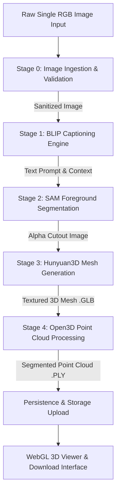

# KLE Society's

# KLE Technological University, Hubballi

## Department Of MCA

### MCA IV Semester

# CHAPTER – 5

# IMPLEMENTATION

## On

# “Automated Single-Image to 3D Asset and Point Cloud Generation System”

**Submitted by:**
Rajashekhar B Durgad (01FE24MCA027)

**Under the Guidance of:**
Prof. Akash Hulkund

**KLE Technological University**
Vidyanagar, Hubballi – 580031
2025-2026

---

## 5.1 Proposed Methodology

The Automated Single-Image to 3D Asset and Point Cloud Generation System implements an end-to-end generative AI pipeline. The proposed methodology transforms a single 2D RGB image into a textured 3D mesh (`.GLB`) and a segmented point cloud (`.PLY`) through sequential model execution, automated GPU memory management, and WebGL rendering.



### 5.1.1 Methodology Explanation

1. **Image Ingestion & Validation:** Validates format (JPG/PNG/WEBP/BMP), caps size ≤ 25 MB, and inspects magic header bytes.
2. **Text Prompt & Context (BLIP):** Generates object description prompts from the input image.
3. **Foreground Segmentation (SAM):** Strips background clutter and outputs an RGBA cutout with an alpha matte.
4. **Generative 3D Mesh Synthesis (Hunyuan3D):** Synthesizes multi-view features and extracts a textured 3D mesh (`.GLB`).
5. **Point Cloud Sampling & Normals (Open3D):** Samples surface points, estimates normal vectors, and exports a point cloud (`.PLY`).
6. **WebGL Rendering & Export:** Streams assets to React Three Fiber viewer for interactive inspection and download.

---

### 5.1.2 Algorithm Explanations

#### Algorithm 5.1: Multi-Stage Asynchronous 3D Reconstruction Pipeline

|       Line       | Pseudocode Step                                                                                |
| :--------------: | :--------------------------------------------------------------------------------------------- |
| **Input** | `raw_image_path` (String), `job_id` (UUID)                                                 |
| **Output** | `ReconstructionResult` (GLB_path, PLY_path, PNG_path, status)                                |
|   **1**   | `UpdateJobProgress(job_id, stage="Processing", progress=0%)`                                 |
|   **2**   | `caption = BLIP_Model_Inference(raw_image_path); FlushGPUCache()`                            |
|   **3**   | `rgba_cutout = SAM_Segment_Foreground(raw_image_path, prompt=caption)`                       |
|   **4**   | `cutout_path = SavePNG(rgba_cutout); FlushGPUCache()`                                        |
|   **5**   | `mesh_3d = Hunyuan3D_Mesh_Inference(cutout_path)`                                            |
|   **6**   | `glb_path = ExportToGLB(mesh_3d); FlushGPUCache()`                                           |
|   **7**   | `point_cloud = Open3D_Sample_Normals(mesh_3d, num_points=10000)`                             |
|   **8**   | `ply_path = ExportToPLY(point_cloud)`                                                        |
|   **9**   | `UpdateJobProgress(job_id, stage="Completed", progress=100%, status="COMPLETED")`            |
|   **10**   | **Return** `ReconstructionResult(glb_path, ply_path, cutout_path, status="COMPLETED")` |

---

#### Algorithm 5.2: Zero-Shot Foreground Segmentation (SAM)

|       Line       | Pseudocode Step                                                     |
| :--------------: | :------------------------------------------------------------------ |
| **Input** | `input_rgb_image` (Tensor)                                        |
| **Output** | `rgba_cutout` (Image with Alpha Channel)                          |
|   **1**   | `normalized_image = NormalizeImage(input_rgb_image)`              |
|   **2**   | `image_embedding = SAM_Image_Encoder(normalized_image)`           |
|   **3**   | `low_res_masks = SAM_Mask_Decoder(image_embedding)`               |
|   **4**   | `primary_mask = SelectLargestMask(low_res_masks)`                 |
|   **5**   | `alpha_matte = ApplyGuidedFilter(input_rgb_image, primary_mask)`  |
|   **6**   | `rgba_cutout = ConcatenateChannels(input_rgb_image, alpha_matte)` |
|   **7**   | **Return** `rgba_cutout`                                    |

---

#### Algorithm 5.3: Surface Point Sampling & Normal Estimation

|       Line       | Pseudocode Step                                                                      |
| :--------------: | :----------------------------------------------------------------------------------- |
| **Input** | `mesh_glb` (Triangle Mesh), `target_count` (Integer K)                           |
| **Output** | `point_cloud_ply` (PointCloud Object)                                              |
|   **1**   | `open3d_mesh = LoadTriangleMesh(mesh_glb)`                                         |
|   **2**   | `point_cloud = open3d_mesh.SamplePointsPoissonDisk(number_of_points=target_count)` |
|   **3**   | `point_cloud.EstimateNormals(search_param=KDTreeSearchParamKNN(knn=30))`           |
|   **4**   | `clean_cloud = point_cloud.VoxelDownSample(voxel_size=0.005)`                      |
|   **5**   | **Return** `clean_cloud`                                                     |

---

## 5.2 Modules

The system is decomposed into six core modules handling authentication, validation, AI model inference, and WebGL visualization.

### Module Overview

| Module ID        | Module Name                                | Primary Function                                           | Core Technology                 |
| :--------------- | :----------------------------------------- | :--------------------------------------------------------- | :------------------------------ |
| **MOD-01** | User Authentication & Session Management   | User login, signup, and JWT session handling.              | FastAPI, Supabase Auth          |
| **MOD-02** | Image Ingestion & Sanitized Validation     | Validates files, caps size ≤ 25 MB, inspects magic bytes. | FastAPI, Pillow, imghdr         |
| **MOD-03** | Foreground Object Segmentation             | Removes background clutter; generates RGBA cutout.         | SAM (Segment Anything), PyTorch |
| **MOD-04** | Generative 3D Mesh Reconstruction          | Synthesizes textured 3D GLB mesh from image.               | Hunyuan3D, PyTorch, CUDA 12.1   |
| **MOD-05** | Point Cloud Extraction & Normal Estimation | Samples points, computes normals, exports PLY file.        | Open3D, NumPy                   |
| **MOD-06** | WebGL 3D Visualization & Asset Export      | Renders 3D mesh/point cloud with orbit controls.           | Next.js 15, React Three Fiber   |

---

### 5.2.1 Module Descriptions

#### Module 1: User Authentication & Session Management (`MOD-01`)

- **Description:** Manages user login, signup, and JWT session token verification.
- **Input:** User credentials (email, password) or Authorization JWT header.
- **Output:** JWT Session Token or Session Context.
- **Code:**

```python
# MOD-01: Authentication Handler (FastAPI + Supabase)
from fastapi import APIRouter, Depends, HTTPException
from fastapi.security import HTTPBearer

router = APIRouter(prefix="/api/v1/auth")

@router.post("/login")
async def login_user(email: str, password: str):
    response = supabase.auth.sign_in_with_password({"email": email, "password": password})
    return {"access_token": response.session.access_token, "user_id": response.user.id}
```

---

#### Module 2: Image Ingestion & Sanitized Validation (`MOD-02`)

- **Description:** Enforces file extension validation, caps size to ≤ 25 MB, and inspects magic header bytes.
- **Input:** Uploaded binary image file stream (`UploadFile`).
- **Output:** Validated image bytes or HTTP 400 error.
- **Code:**

```python
# MOD-02: Image Validation Middleware
import imghdr
from fastapi import UploadFile, HTTPException

async def validate_uploaded_image(file: UploadFile) -> bytes:
    file_bytes = await file.read()
    if len(file_bytes) > 25 * 1024 * 1024:
        raise HTTPException(status_code=400, detail="File exceeds 25 MB cap.")
    if imghdr.what(None, h=file_bytes) not in {"jpeg", "png", "webp", "bmp"}:
        raise HTTPException(status_code=400, detail="Invalid image magic header bytes.")
    return file_bytes
```

---

#### Module 3: Foreground Object Segmentation (`MOD-03`)

- **Description:** Segment Anything Model (SAM) extracts the foreground subject and generates an RGBA cutout.
- **Input:** Preprocessed RGB Image.
- **Output:** RGBA Cutout PNG Image.
- **Code:**

```python
# MOD-03: SAM Foreground Object Segmentation
import numpy as np
import torch
from segment_anything import sam_model_registry, SamAutomaticMaskGenerator

def extract_foreground(image, model_checkpoint="sam_vit_h.pth"):
    sam = sam_model_registry["vit_h"](checkpoint=model_checkpoint).to("cuda")
    masks = SamAutomaticMaskGenerator(sam).generate(np.array(image))
    primary_mask = max(masks, key=lambda x: x["area"])["segmentation"]
    torch.cuda.empty_cache()
    return CreateRGBAImage(image, primary_mask)
```

---

#### Module 4: Generative 3D Mesh Reconstruction (`MOD-04`)

- **Description:** Hunyuan3D framework reconstructs multi-view features and extracts a textured `.GLB` mesh.
- **Input:** RGBA Foreground Cutout Image.
- **Output:** Textured 3D Mesh file (`.GLB`).
- **Code:**

```python
# MOD-04: Hunyuan3D Mesh Generation Inference
import torch
import trimesh
from hunyuan3d import Hunyuan3DPipeline

def generate_3d_mesh(rgba_cutout_path: str, output_glb_path: str) -> str:
    pipeline = Hunyuan3DPipeline.from_pretrained("Tencent/Hunyuan3D-2").to("cuda")
    with torch.no_grad():
        mesh_output = pipeline(rgba_cutout_path)
        trimesh.Scene(mesh_output).export(output_glb_path, file_type="glb")
    torch.cuda.empty_cache()
    return output_glb_path
```

---

#### Module 5: Point Cloud Extraction & Normal Estimation (`MOD-05`)

- **Description:** Open3D samples surface points from GLB mesh, estimates normal vectors, and exports `.PLY` file.
- **Input:** Reconstructed 3D Mesh (`.GLB`).
- **Output:** Point Cloud File (`.PLY`).
- **Code:**

```python
# MOD-05: Open3D Point Cloud Extraction & Normal Estimation
import open3d as o3d

def extract_point_cloud(glb_mesh_path: str, output_ply_path: str, num_points=10000):
    mesh = o3d.io.read_triangle_mesh(glb_mesh_path)
    pcd = mesh.sample_points_poisson_disk(number_of_points=num_points)
    pcd.estimate_normals(search_param=o3d.geometry.KDTreeSearchParamKNN(knn=30))
    pcd_clean = pcd.voxel_down_sample(voxel_size=0.005)
    o3d.io.write_point_cloud(output_ply_path, pcd_clean)
    return output_ply_path
```

---

#### Module 6: WebGL 3D Visualization & Asset Export (`MOD-06`)

- **Description:** Renders GLB 3D mesh and PLY point cloud in browser canvas with orbit controls and download options.
- **Input:** GLB and PLY asset URLs.
- **Output:** Interactive WebGL 3D Canvas & File Downloads.
- **Code:**

```tsx
// MOD-06: React Three Fiber 3D Canvas Viewer Component
import React, { Suspense } from 'react';
import { Canvas } from '@react-three/fiber';
import { OrbitControls, useGLTF, Stage } from '@react-three/drei';

export default function ModelViewer({ glbUrl }: { glbUrl: string }) {
  const { scene } = useGLTF(glbUrl);
  return (
    <Canvas camera={{ position: [0, 0, 2.5], fov: 50 }}>
      <Suspense fallback={null}>
        <Stage environment="city"><primitive object={scene} /></Stage>
      </Suspense>
      <OrbitControls autoRotate enableZoom />
    </Canvas>
  );
}
```
