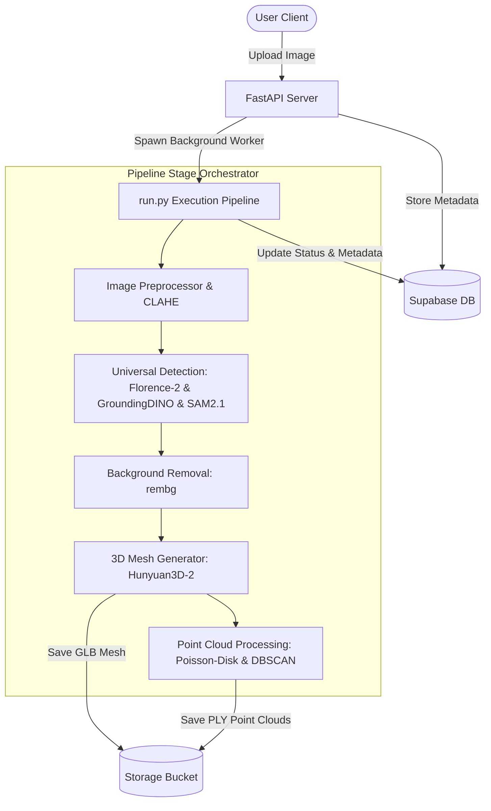
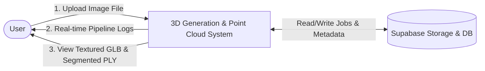
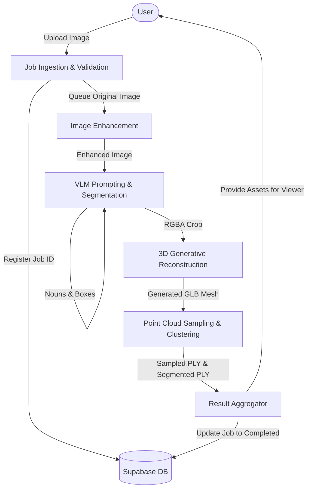
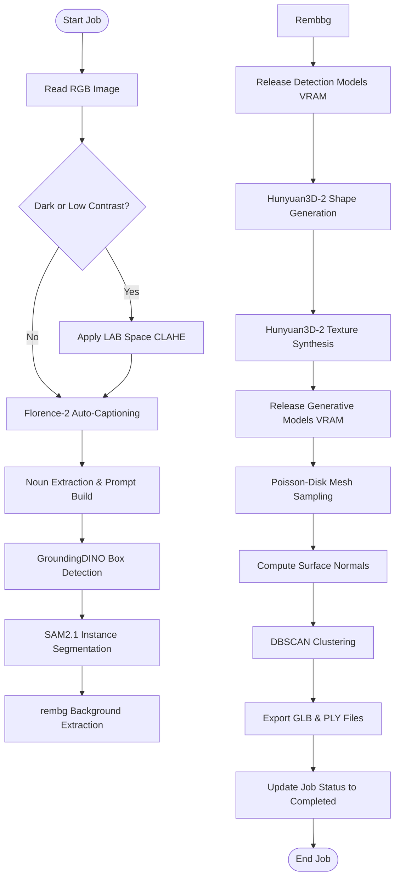

# KLE Society's
# KLE Technological University, Hubballi
## Department Of MCA
### MCA IV Semester

# SRS Report
## On
# “Automated Single-Image to 3D Asset and Point Cloud Generation System”

**Submitted by:**  
Rajashekhar B Durgad (01FE24MCA027)

**Under the Guidance of:**  
Prof. Akash Hulkund

**KLE Technological University**  
Vidyanagar, Hubballi – 580031  
2025-2026

---

# 1. INTRODUCTION

## 1.1 Overview
This Software Requirements Specification (SRS) document describes the complete functional, non-functional, and system requirements for the **Automated Single-Image to 3D Asset and Point Cloud Generation System**. The system is a fully automated, end-to-end generative AI and point cloud analysis pipeline that reconstructs high-fidelity textured 3D assets and segmented 3D point clouds from a single RGB image input.

## 1.2 Purpose
The purpose of this system is to bridge the gap between 2D digital images and interactive 3D assets, eliminating manual prompt engineering and tedious photogrammetry setups. The system is designed to provide rapid asset generation for developers, designers, and researchers working in fields such as E-commerce, Augmented/Virtual Reality (AR/VR), Robotics, and Digital Twins.

## 1.3 Scope
The scope of this project includes:
* **Adaptive Preprocessing:** Automated analysis and enhancement of input images under imperfect lighting conditions.
* **Universal Object Detection & Part Segmentation:** A zero-shot open-vocabulary detection and instance segmentation pipeline combining Florence-2 and SAM2.1.
* **Generative 3D Asset Reconstruction:** Seamless background removal and 3D mesh generation using the Hunyuan3D-2 framework to output textured GLB models.
* **Downstream 3D Analysis:** Conversion of generated meshes to dense point clouds with normals, followed by geometric clustering using DBSCAN.
* **Interactive Visualization:** Web-based and interactive viewing of generated 3D meshes and point clouds.

---

# 2. SYSTEM DESCRIPTION

## 2.1 Existing System
Most existing 3D reconstruction systems rely on multi-view photogrammetry, manual modeling, or isolated machine learning tools. These setups require multiple camera angles, controlled environment lighting, or extensive manual data cleanup.

### Drawbacks of Existing Systems:
* **High Barrier to Entry:** Specialized 3D modeling skills or expensive capture hardware are required.
* **Fragmentation:** Separated stages for object extraction, mesh generation, and point cloud conversion, requiring manual data transfer.
* **Brittleness under Real-world Conditions:** Standard pipelines fail on low-contrast, dark, or grayscale photographs.
* **Prompt Dependency:** Many modern generators require manual text prompting to guide shape creation.

## 2.2 Proposed System
The proposed system resolves these challenges by introducing a fully automated, pipeline-oriented single-image reconstruction framework.

* **Adaptive CLI Preprocessing:** Applies local contrast enhancement (CLAHE) automatically for dark or low-contrast inputs.
* **Prompt-Free Operation:** Florence-2 automatically generates natural language captions and extracts nouns, passing them to GroundingDINO without user input.
* **Sequential GPU Memory Management:** Loads, executes, and clears VRAM cache for each model sequentially to enable execution on standard 16 GB GPUs.
* **Integrated Downstream Analysis:** Automatically produces both a textured 3D GLB mesh and a geometrically segmented PLY point cloud in a single run.

### Advantages of Proposed System:
* **Fully Automated:** Reconstructs 3D shapes in 3–4 minutes from a single button click.
* **Robust & Adaptive:** Works with low-contrast, dark, or grayscale scenes.
* **Low Hardware Overhead:** Optimized sequential memory swapping prevents Out-Of-Memory (OOM) errors on a single GPU.
* **Modular Design:** Enables swapping of components (e.g., upgrading the 3D generator or object segmenter) without rewriting the core workflow.

---

# 3. USERS OF THE SYSTEM

| User Type | Description |
| :--- | :--- |
| **Admin** | Responsible for system maintenance, GPU pipeline monitoring, server configuration, and model checkpoint management. |
| **End-User / Developer** | Uploads images, views logs, visualizes generated models/point clouds, and downloads final GLB/PLY outputs. |

---

# 4. HARDWARE AND SOFTWARE REQUIREMENTS

## 4.1 Hardware Requirements
* **Processor:** Intel Core i5 or AMD Ryzen 5 (or higher)
* **RAM:** Minimum 12 GB system RAM (16 GB recommended)
* **GPU:** NVIDIA GPU with a minimum of 16 GB VRAM (e.g., NVIDIA T4, RTX 3080, or A10G) supporting CUDA 12.1
* **Storage:** Minimum 50 GB free disk space
* **Output Display:** Monitor supporting a resolution of 1280×720 or higher

## 4.2 Software Requirements
* **Operating System:** Linux (Ubuntu 20.04+) or Windows 10/11
* **Programming Language:** Python 3.10+
* **Deep Learning Framework:** PyTorch 2.x with CUDA 12.1 support
* **3D Libraries:** Open3D (>= 0.16), Trimesh
* **Image Libraries:** OpenCV, Pillow, NumPy
* **Background Removal:** `rembg` with ONNX GPU runtime
* **Database:** Supabase (for job tracking and asset metadata)
* **Frontend:** Next.js with TailwindCSS (or vanilla CSS) and Three.js/React Three Fiber for web visualizations

---

# 5. FUNCTIONAL REQUIREMENTS

* **FR-1: Adaptive Image Preprocessing:** The system shall compute mean image brightness and contrast. If brightness is below 0.30 or contrast standard deviation is below 0.15, it shall apply CLAHE in the LAB color space.
* **FR-2: Automated Prompting:** The system shall use Florence-2 to auto-caption the input image and extract the primary subject nouns for detection.
* **FR-3: Zero-Shot Bounding Box Detection:** The system shall perform multi-pass GroundingDINO detection (thresholds 0.20 → 0.15 → 0.10) to obtain the primary object bounding box.
* **FR-4: Bounding Box Masking:** The system shall pass the detected box coordinates to SAM2.1 to generate pixel-precise binary instance masks.
* **FR-5: Background Extraction:** The system shall mask out the background using the generated mask and `rembg` to produce a transparent RGBA crop.
* **FR-6: 3D Shape Generation:** The system shall feed the RGBA crop to Hunyuan3D-2 Stage 1 to generate a watertight 3D shape mesh.
* **FR-7: UV Texture Mapping:** The system shall synthesize and bake appearance-flow textures at 1024x1024 resolution onto the mesh using Hunyuan3D-2 Stage 2.
* **FR-8: Point Cloud Extraction:** The system shall sample 100,000 points from the surface of the generated GLB mesh using Poisson-disk sampling.
* **FR-9: Geometric Point Cloud Segmentation:** The system shall compute surface normals and segment the sampled point cloud using DBSCAN clustering, saving the output with distinct color labels as a PLY file.
* **FR-10: Pipeline Memory Recovery:** To prevent VRAM OOM, the system shall release GPU memory and call `torch.cuda.empty_cache()` between each model execution phase.

---

# 6. NON-FUNCTIONAL REQUIREMENTS

* **Reliability:** The pipeline shall gracefully handle failures at any individual stage (e.g., fallback to original image if CLAHE fails, or record logs on failure) and update job status in Supabase.
* **Performance (Latency):** The end-to-end pipeline execution time shall be within 3 to 4 minutes when running on a dedicated 16 GB VRAM GPU.
* **VRAM Efficiency:** The system VRAM footprint shall not exceed 16 GB at any peak usage stage by strictly enforcing sequential loading.
* **Scalability & Modularity:** Individual models (e.g., GroundingDINO, SAM2.1, or Hunyuan3D-2) must be decoupled into independent python modules, allowing individual updates.
* **Usability:** The web dashboard shall show real-time stage progress logs and allow interactive 3D rotation of meshes and point clouds directly inside the browser.

---

# 7. SYSTEM DESIGN

## 7.1 Input Design
Users submit an RGB image in standard formats (JPEG, PNG, WebP, or BMP) via a drag-and-drop web portal or API endpoint. The backend validates file format and size limits, storing the original image path and triggering a background task associated with a unique `job_id`.

```
User Upload -> File Validation (Size, Extension) -> Store in Storage -> Trigger Pipeline Task
```

## 7.2 Output Design
Upon pipeline completion, the system saves the following artifacts into the job's output directory and updates Supabase metadata:
1. `enhanced.png` (CLAHE Preprocessed image)
2. `rgba.png` (Background-removed crop)
3. `model.glb` (Textured 3D mesh asset)
4. `pointcloud.ply` (Dense sampled point cloud)
5. `pointcloud_segmented.ply` (Color-labeled DBSCAN clusters)

## 7.3 Architecture Diagram


## 7.4 Level 0 DFD


## 7.5 Level 1 DFD


## 7.6 Flowchart Diagram


---

# 8. TESTING PLAN

* **Unit Testing:** Write PyTest scripts for individual modules (e.g., testing CLAHE output threshold values, verifying noun parsing functions, and validation checks for bounding boxes).
* **Integration Testing:** Test stage-to-stage communication (e.g., verifying that the SAM2.1 output mask correctly aligns with rembg input requirements).
* **VRAM Boundary Testing:** Run the pipeline continuously with consecutive jobs to verify that memory release hooks prevent GPU memory leaks.
* **System Testing (End-to-End):** Run the complete worker pipeline on a suite of target benchmark images (dark, grayscale, clear, and complex scenes) and verify database state changes and asset file availability.

---

# 9. LIMITATIONS

* **Hardware Dependency:** Requires an NVIDIA GPU with a minimum of 16 GB VRAM. Runs slower or might fail on standard consumer CPUs due to heavy generative model architectures.
* **Single-Object Assumption:** The generative core (Hunyuan3D-2) is optimized for single-object asset creation; multi-object scenes are merged or reconstructed as a single mesh group.

---

# 10. FUTURE SCOPE

* **Real-time Engine Optimization:** Integrate TensorRT and INT8 quantization for Hunyuan3D-2 diffusion modules to lower latency under 1 minute.
* **Multi-Object Parsing:** Implement bounding box cropping and batch execution to reconstruct complex scenes containing multiple isolated objects.
* **Video to 3D Support:** Utilize SAM2.1 video tracking on product turntables to construct multi-view consistent 3D representations.

---

# 11. CONCLUSION
The **Automated Single-Image to 3D Asset and Point Cloud Generation System** successfully integrates modern vision-language models, state-of-the-art segmentation, and high-fidelity 3D generators into a single cohesive pipeline. This system delivers a robust, prompt-free, and resource-managed alternative to classical photogrammetry, providing high-value assets for 3D downstream workflows.
